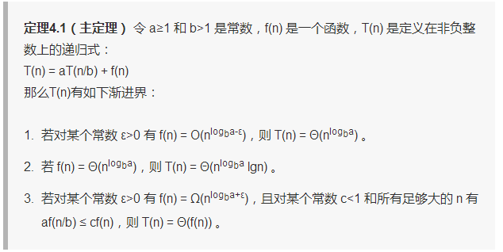
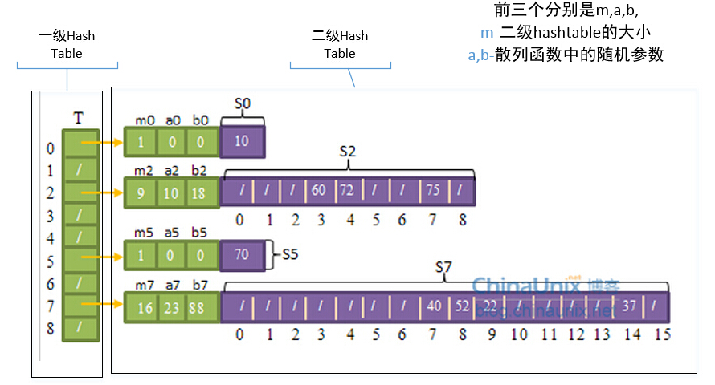
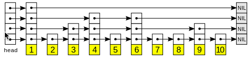

# Introduction to Algorithm

- 说明lgn是以2为底的对数
- 编译环境：g++ (Ubuntu 5.4.0-6ubuntu1~16.04.4) 5.4.0 20160609
- g++ -std=c++11 XX.cpp -o XX


##  第一课 算法分析
- 插入排序 [源码](https://github.com/xuyicpp/Classical_Algorithms/blob/master/Introduction_to_Algorithms/Insertion_Sort.cpp)
- 归并排序 [源码](https://github.com/xuyicpp/Classical_Algorithms/blob/master/Introduction_to_Algorithms/Merge_Sort.cpp)

## 第二课 渐近符号、递归及解法

- f(n)的值总位于c1g(n)与c2g(n)之间或等于它们，那么记f(n)=Θ(g(n))。
- f(n)的值总小于或等于cg(n),那么记f(n)=O(g(n))。
- f(n)的值总大于或等于cg(n),那么记f(n)=Ω(g(n))。
- 用主方法求解递归式，
如下图：



另外这一篇BLOG详细了介绍了这种方法的用途：[BLOG](http://www.jianshu.com/p/4d0b005782d9)

## 第三课 分冶法（Divide and Conquer）
- 二分法 [源码](https://github.com/xuyicpp/Classical_Algorithms/blob/master/Introduction_to_Algorithms/Binary_Search.cpp)
- 菲波那切数列 [源码](https://github.com/xuyicpp/Classical_Algorithms/blob/master/Introduction_to_Algorithms/Fibonacci.cpp)
- 结：朴素递归算法用时太多，实用价值不大，自底向上算法效率为线性，较高，平时用较多，递归平方算法效率为对数级，且编程可实现，实用价值很大。并且经过测试，当n值变很大后，递归平方算法效率明显高于自底向上算法效率。[BLOG](http://www.cnblogs.com/zhoutaotao/p/3964997.html)

## 第四课 快排及随机化算法
- 快速排序及随机快速排序 [源码](https://github.com/xuyicpp/Classical_Algorithms/blob/master/Introduction_to_Algorithms/Quick_Sort.cpp)
- Hoare的代码对快排有重复的情况运行的更好。
- 随机化快速排序，其运行时间不依赖于输入序列的顺序Θ(nlgn),一般来说比归并快3倍。
- 这篇博客对此进行了详细的介绍我就摘录了一些 [BLOG](http://www.cnblogs.com/zhoutaotao/p/3970099.html)
自我小结：对随机产生的数组进行排序，1）可以发现插入排序没有优势、特别是数组比较大时耗时太多；2）快速排序、随机化快速排序、归并排序性能不错，然而两种快排比归并排序性能好点；3）当数据量变大时，可以看出性能排序为快速排序、随机化快速排序、归并排序、插入排序；4）由于这里的数组是由随机数产生的，没有显示出随机化快速排序的优势，但是当数组为已排序情况下随机化快排将比快排性能好。


- 附：堆排序：[源码](https://github.com/xuyicpp/Classical_Algorithms/blob/master/Introduction_to_Algorithms/Heapsort.cpp) [算法详解](https://jingyan.baidu.com/article/5225f26b057d5de6fa0908f3.html)(注：这里的堆顶的下标是从1开始的)


## 第五课 线性时间排序

- 在最坏情况下，任何比较排序算法都需要做Ω(nlgn)次比较。故堆排序和归并排序都是渐进最优的比较排序算法。
- 计数排序 [源码](https://github.com/xuyicpp/Classical_Algorithms/blob/master/Introduction_to_Algorithms/Counting_Sort.cpp)

它的优势在于在对一定范围内的整数排序时，它的复杂度为Ο(n+k)（其中k是整数的范围），快于任何比较排序算法。当然这是一种牺牲空间换取时间的做法，而且当O(k)>O(n*log(n))的时候其效率反而不如基于比较的排序（基于比较的排序的时间复杂度在理论上的下限是O(n*log(n)), 如归并排序，堆排序）

- 基数排序 [源码](https://github.com/xuyicpp/Classical_Algorithms/blob/master/Introduction_to_Algorithms/Radix_Sort.cpp)

源码中实现排序的代码是和计数排序一样的。
基数排序（radix sort）属于“分配式排序”（distribution sort），又称“桶子法”（bucket sort）或bin sort，顾名思义，它是透过键值的部份资讯，将要排序的元素分配至某些“桶”中，藉以达到排序的作用，基数排序法是属于稳定性的排序，其时间复杂度为O (nlog(r)m)，其中r为所采取的基数，而m为堆数，在某些时候，基数排序法的效率高于其它的稳定性排序法。

## 第六课 顺序统计、中值

- 随机选择算法(一般选择这个) [源码](https://github.com/xuyicpp/Classical_Algorithms/blob/master/Introduction_to_Algorithms/Randomized_Select.cpp) :

运行时间的复杂度期望是Θ(n),最坏的情况复杂度为Θ(n2)。

- 最坏线性选择算法 [源码](https://github.com/xuyicpp/Classical_Algorithms/blob/master/Introduction_to_Algorithms/Worse_Linear_Select.cpp) :

相比于上面的随机选择，我们有另一种类似的算法，它在最坏情况下也能达到O(n)。它也是基于数组的划分操作，而且利用特殊的手段保证每次划分两边的子数组都比较平衡；与上面算法不同之处是：本算法不是随机选择主元，而是采取一种特殊的方法选择“中位数”，这样能使子数组比较平衡，避免了上述的最坏情况（Ө(n^2)）。选出主元后，后面的处理和上述算法一致。


参考博客 [BLOG](http://www.cnblogs.com/zhoutaotao/p/4047082.html)

## 第七课 哈希表(hash table)

- 代码采用开放寻址法处理冲突，包括线性探查、二次探查、双重散列探查、随机散列探查实现(探查法采用二次探查)；散列函数采用简单的除法散列函数；当插入一个新元素产生冲突次数过多时，进行再散列。[源码](https://github.com/xuyicpp/Classical_Algorithms/blob/master/Introduction_to_Algorithms/HashTable.cpp)

散列表是普通数组概念的推广，在散列表中，不是直接把关键字用作数组下标，而是根据关键字通过散列函数计算出来的。

当实际存储的关键字数目比全部的可能关键字总数要小时，采用散列表就成为直接数组寻址的一种有效的替代。

关键技术：
- 直接寻址、散列寻址
- 散列函数(除法散列、乘法散列、全域散列、完全散列)
- 碰撞处理方法：链表法、开放寻址法(线性探查、二次探查、双重散列、随机散列)
- 再散列问题


参考博客 [网易公开课算法导论第七课 ——哈希表](http://www.guokr.com/blog/483397/)、
[网易公开课算法导论第七课 ——哈希表](http://www.cnblogs.com/zhoutaotao/p/4067749.html)

## 第八课 全域哈希和完全哈希(Universal hashing and Perfect hashing)

- 任何一个特定的散列函数都可能将特定的n个关键字全部散列到同一个槽中，使得平均的检索时间为Θ(n)。为了避免这种情况，唯一有效的改进方法是随机地选择散列函数，使之独立与要存储的关键字。这种方法称为全域散列(universal hashing)。全域散列在执行开始时，就从一组精心设计的函数中，随机地选择一个作为散列函数。因为随机地选择散列函数，算法在每一次执行时都会有所不同，甚至相同的输入都会如此。这样就可以确保对于任何输入，算法都具有较好的平均情况性能. 

- 首先第一级使用全域散列把元素散列到各个槽中，这与其它的散列表没什么不一样。但在处理碰撞时，并不像链接法（碰撞处理方法）一样使用链表，而是对在同一个槽中的元素再进行一次散列操作。也就是说，每一个（有元素的）槽里都维护着一张散列表，该表的大小为槽中元素数的平方，例如，有3个元素在同一个槽的话，该槽的二级散列表大小为9。不仅如此，每个槽都使用不同的散列函数，在全域散列函数簇h(k) = ((a*k+b) mod p) mod m中选择不同的a值和b值，但所有槽共用一个p值如101。每个槽中的（二级）散列函数可以保证不发生碰撞情况。当第一级散列表的槽的数量和元素数量相同时(m=n)，所有的二级散列表的大小的总量的期望值会小于2*n，即Ө(n)。



## 第九课 二叉搜索树(binary search trees)

- 随机化二叉搜索树本质上与随机化的快速排序相等,既然二叉搜索树的BST排序和快速排序效率相同，那么我们为什么还要研究它呢？原因在于，本数据结构能够支持更加快速的动态操作，诸如删除、修改、插入等操作。

- Randomized Binary Search Trees Code [源码](https://github.com/xuyicpp/Classical_Algorithms/blob/master/Introduction_to_Algorithms/Randomized_BST_Sort.cpp)
- 参考BLOG [算法导论-二叉查找树](http://www.cnblogs.com/zhoutaotao/p/4096237.html)

## 第十课 平衡搜索树
- 红黑树的面试考点一般为，红黑树的特性和红黑树的基本操作：添加。

- 红黑树（Red Black Tree） 是一种自平衡二叉查找树，是在计算机科学中用到的一种数据结构，典型的用途是实现关联数组。它的统计性能要好于平衡二叉树(有些书籍根据作者姓名，Adelson-Velskii和Landis，将其称为AVL-树)

- 红黑树的应用比较广泛，主要是用它来存储有序的数据，它的时间复杂度是O(lgn)，效率非常之高。例如，Java集合中的TreeSet和TreeMap，C++ STL中的set、map，以及Linux虚拟内存的管理，都是通过红黑树去实现的。

- 红黑树的特性：
(1) 每个节点或者是黑色，或者是红色。
(2) 根节点是黑色。
(3) 每个叶子节点是黑色。 [注意：这里叶子节点，是指为空的叶子节点！]
(4) 如果一个节点是红色的，则它的子节点必须是黑色的。
(5) 从一个节点到该节点的子孙节点的所有路径上包含相同数目的黑节点。

- 红黑树的基本操作：添加
第一步：将红黑树当做一颗二叉查找，将节点插入。
第二步：将插入的节点着色为“红色”。
第三步：通过一系列的旋转或着色等操作，使之重新成为一颗红黑树。

- 其中第三步一共有根据父节点以及祖父节点、叔叔节点共分为5种情况。但核心思想都是将红色的节点移到根节点；然后将根节点设为黑色。

- 红黑树的基本操作：删除
第一步：将红黑树当作一颗二叉查找树，将节点删除。
第二步：通过“选转和重新着色”等一系列来修正该树，使之重新成为一颗红黑树。（分为四种情况）


- 源码:[RedBlackTree.h](https://github.com/xuyicpp/Classical_Algorithms/blob/master/Introduction_to_Algorithms/RedBlackTree.h)、[RedBlackTreeTest.cpp](https://github.com/xuyicpp/Classical_Algorithms/blob/master/Introduction_to_Algorithms/RedBlackTreeTest.cpp)

- 参考BLOG:[红黑树(一)之 原理和算法详细介绍](http://www.cnblogs.com/skywang12345/p/3245399.html)、[红黑树(四)之 C++的实现](http://www.cnblogs.com/skywang12345/p/3624291.html)。

- 附录:[do..while(0)的用法](http://www.cppblog.com/woaidongmao/archive/2009/03/11/76211.html)

## 第十一课 扩充的数据结构、动态有序统计和区间树

### 方法论：如<OSTree—顺序统计树>
- 1：选择一个基础的数据结构(red-black tree)
- 2：在数据统计中维护一些附加信息(子树大小)
- 3：验证这个数据结构上的信息不会受修改操作的影响(insert, delete---rotations)
- 4：建立新的运算。假设新的数据已经存好了，然后开始使用这些信息(os_select, os_rank).

- 动态顺序统计(红黑树实现):一种支持一般动态集合上，顺序统计操作的数据结构。通过这种数据结构，可以快速地找到一个集合中的第i小的数，（select）或给出一个指定元素在集合的全序中的位置。（rank）

- 源码：[DynamicOrderStatisticsTree.h](https://github.com/xuyicpp/Classical_Algorithms/blob/master/Introduction_to_Algorithms/DynamicOrderStatisticsTree.h)、[DOSTree.cpp](https://github.com/xuyicpp/Classical_Algorithms/blob/master/Introduction_to_Algorithms/DOSTree.cpp)、[DynamicOrderStatisticsTreeTest.cpp](https://github.com/xuyicpp/Classical_Algorithms/blob/master/Introduction_to_Algorithms/DynamicOrderStatisticsTreeTest.cpp)

- 区间树:一种对动态集合进行维护的红黑树，其中每个元素x都包含一个区间x.int。
区间树支持下列操作：
（1）INTERVAL-INSERT( T, x )：将包含区间属性的int的元素x插入到树T中。
（2）INTERVAL-DELETE( T, x )：从T删除x。
（3）INTERVAL-SEARCH( T, i )：返回一个指向T中元素x的指针，使x.int与i重叠。不存在返回T.nil。

- 源码：[IntervalTree.h](https://github.com/xuyicpp/Classical_Algorithms/blob/master/Introduction_to_Algorithms/IntervalTree.h)、[IntervalTree.cpp](https://github.com/xuyicpp/Classical_Algorithms/blob/master/Introduction_to_Algorithms/IntervalTree.cpp)、[InternalTreeTest.cpp](https://github.com/xuyicpp/Classical_Algorithms/blob/master/Introduction_to_Algorithms/InternalTreeTest.cpp)


- 参考BLOG:[MIT：算法导论——11.扩充的数据结构、动态有序统计和区间树](http://blog.csdn.net/loveprogram_1/article/details/32318211)、[算法系列笔记5(扩展数据结构-动态顺序统计和区间树)](http://blog.csdn.net/lu597203933/article/details/43459035)

## 第十二课 跳跃表

### skip list 介绍

- Skip list是一个用于有序元素序列快速搜索的数据结构，由美国计算机科学家William Pugh发明于1989年。它的效率和红黑树以及 AVL 树不相上下，但实现起来比较容易。Skip list是一个“概率型”的数据结构，可以在很多应用场景中替代平衡树。Skip list算法与平衡树相比，有相似的渐进期望时间边界，但是它更简单，更快，使用更少的空间。 
Skip list是一个分层结构多级链表，最下层是原始的链表，每个层级都是下一个层级的“高速跑道”。


### skip list 空间分析

- 假设一个链表的长度为T=2ⁿ，每次提升的概率为P=1/2，由等比公式可得存储的空间为2T，所以空间复杂度为2 * Θ(T) ≈ Θ(n)。查找、插入、删除的时间复杂度为Θ(㏒n)。


- 源码:[SkipList.cpp](https://github.com/xuyicpp/Classical_Algorithms/blob/master/Introduction_to_Algorithms/SkipList.cpp)


- 参考BLOG:[跳跃表以及C++实现](http://blog.csdn.net/yinlili2010/article/details/39503655)、[【算法导论】 第十二课 跳跃表](http://blog.csdn.net/lth404391139/article/details/45111689)、[【算法导论33】跳跃表（Skip list）原理与java实现](http://blog.csdn.net/brillianteagle/article/details/52206261)、[数据结构与算法(c++)——跳跃表(skip list)](http://www.cnblogs.com/learnhow/p/6749648.html)

## 第十三课 平摊分析，表的扩增，势能方法

### 平摊分析概念

- 给定一连串操作(这里的操作具有一定的规律，例如有MULTIPOP操作的栈，或者vector)，大部分的操作是非常廉价的，有极少的操作可能非常昂贵，因此一个标准的最坏分析可能过于消极了。因此，其基本理念在于，当昂贵的操作也别少的时候，他们的成本可能会均摊到所有的操作上。如果人工均摊的花销仍然便宜的话，对于整个序列的操作我们将有一个更加严格的约束。本质上，均摊分析就是在最坏的场景下，对于一连串操作给出一个更加严格约束的一种策略。

- 均摊分析与平均情况分析的区别在于，平均情况分析是平均所有的输入，比如，INSERTION SORT算法对于所有可能的输入在平均情况下表现性能不错就算它在某些输入下表现性能是非常差的。而均摊分析是平均操作，比如，TABLEINSERTION算法在所有的操作上平均表现性能很好尽管一些操作非常耗时。在均摊分析中，概率是没有被包含进来的，并且保证在最坏情况下每一个操作的平均性能。因此n个元素插入的平摊代价（单次插入）为O(1)

### 平摊分析有三种方法

- 聚集分析: 计算n次操作总共的时间，再做平均值。(一般不采用这个)
- 记账法: 对n个操作序列的不同操作赋予不同的平摊代价。
一次操作的实际代价如果小于其平摊代价，则差额作为存款，存起来。
一次操作的时间代价如果大于其平摊代价，则从存款中取出差额，以便完成此次操作。需要注意的是，存款不能为负的。
因此n次操作过程中当前实际的总代价都小于等于当前的总平摊代价。这个平均代价需要自己去算。
- 势能法: 与整个操作序列相关的，定义Di为对数据结构Di-1做第i次操作后的结果，即记录总的存款额。对比记账法，记账法为记录每一次流水，势能则只记录总的存款额。
势能函数的构造可能不止一种，且一般需要很强技巧。
例子的势能函数的一种构造f(Di)=2 * i-2^([lgi])。

### 附录

- 表的扩增: 使用动态表，思想为vector扩展容量的方式，空间满时重新分配两倍当前大小的空间，并移动元素，释放旧的空间。

- 表的搜索: 收缩则是当删除一个后，元素个数小于表大小的1/4，而不是1/2时才收缩表。因为如果以1/2，则如果再立即插入，则会由扩增，从而增大开销。

- 平摊分析对于有实时需求的场合不太适合。(实时操作系统必须及时响应所要求的任务，在限定时间内完成任务。非实时的操作系统，多时间不是很敏感，对所要求的任务只是会保证完成，但在什么时候完成，或用多长的时间完成就不一定了。)

- 参考BLOG:[算法课笔记系列（七）—— 平摊分析](http://www.mamicode.com/info-detail-1345652.html)、[算法设计分析之一（平摊分析，表扩增，势能方法）](http://blog.csdn.net/onyheart/article/details/15797499)

## 第十四课 竞争性分析，自组织表

### 自组织表

- 1.自组织表：
定义两种操作
l  n个元素的列表L，访问（可能是查找，也可以是其他操作）元素x的代价与元素在列表中的位置有关（从表头到x的距离）。
l  元素在L中的位置可以通过交换相邻的元素来改变，而这个操作的代价为O(1)。
如果考虑用户的访问可能是一系列的，而且一个元素被访问后，再次被访问的概率会增大，因此考虑对一个元素访问后将该元素和其前驱的元素交换（代价为O(1)），从而减少其下次访问的代价。
- 1.1 一个操作序列，每次只发送一次操作请求。
在线算法（online）：必须立即完成这步操作，而不管之后的操作是什么（即不能预知后续操作）。
离线算法（offline）：离线算法可以假设可以预读整个序列，从而可以对整个操作序列做优化。
不管在线、离线算法，其目标都是使得对整个操作序列的总的访问代价最小。
- 1.2 复杂度分析
最坏情况分析。
用在线算法使用自组织表，对手每次都可能让我们访问最后一个元素，因此最坏时间为O(n*|S|)，即表长乘操作序列的个数。
平均情况分析。最坏情况无法避免，因此考虑平均情况。
元素x被访问的概率为P(x)（这相当于离线算法）。则对于操作序列，期望的代价为：
每个元素被访问的概率与其位置乘积的和。
因此最小期望为：把元素按访问的概率从大到小排序。因此记录元素被访问的次数，并按访问次数递减的方式排序元素（访问次数大于前驱的访问次数时，进行交换）。因此对于元素x的操作，代价最多为2*rank(x)，因为访问需要rank(x),交换可能需要rank(x)。
思想：前移思想。

### 应用：
这样处理，对于搜索的“流行词”可能会有比较好的反应，因为在一个时期，流行词被搜索的次数会增加，而一旦过了流行期间，其位置可能就被新的流行词替代了。这对于操作序列S的局部反映非常好。
对于高速缓存等其他情况下也可能用到。

### 竞争分析

- 一个在线算法A是a竞争的:如果存在一个常数k，满足对于任何的操作序列S，满足CA（S）<=a * Copt(S) + k
即，算法A对S的操作代价不大于其最优的离线算法乘上 a，再加 k。

- 对于自组织表MTF（Move to front，移前启发式算法：访问一个元素后，就把元素移动到开头）定理是4竞争的。（即便对手总是访问最后一个元素。）对于两个不同的代价，使用平摊分析的势能法来确定这两种代价的差距。

- 4 * Copt(S)从而MTF为4竞争的。

### 对于竞争分析
- 如果数据用链表表示，则从x位置移动到表头的操作只需要常数，因此可以忽略其代价，这时可以证明相应的MTF则为2竞争的。

- 如果表的开始的势不为0，即L0和L0*不想等，比如有可能已经运行过一段时间了。这时候L0的最差情况为和L0*比是反序的，这样逆序为n个元素的逆序，为O(n^2).
这时候Cmtf（S）<=4* Copt(S)+O(n^2)。
如果n的规模相对于S的次数变化不是太大，因此如果操作序列S中的操作为很大时，上式中的O(n^2)也是常量级别的，因此也是4竞争的。
- 如果不是忽略置换的代价，而是一个常数级别的，如3，则相应的结果将改变竞争的常数，常数将不再是4倍。

- 转载自:[http://blog.csdn.net/onyheart/article/details/16331219](http://blog.csdn.net/onyheart/article/details/16331219)

## 第十五课 动态规划，最长公共子序列

### 基本概念

- 动态规划(dynamic programming)与分治方法相似，都是通过组合子问题的解来求解原问题(在这里，"programming"指的是一种表格法，并非编写计算机程序)。

- 分治方法将问题划分为互不相交的子问题。动态规划应用于子问题重叠的情况。动态规划算法对每个子问题只求解一次，将其解保存在一个表格，从而无需每次求解一个子问题时都重新计算，避免了这种不必要的计算工作。

- 动态规划方法通常用来求解最优化问题(optimization problem)。这类问题可以有很多可行解，每个解都有一个值，我们希望寻找具有最优值的解。我们称这样的解为问题的一个最优解(an optimal solution)，而不是最优解(the optimal solution)，因为可能有多个解都达到最优值。

### 核心

我们通常按如下4个步骤来设计一个动态规划算法：
- 1.刻画一个最优解的结构特征。(optimal substruct)
- 2.递归地定义最优解的值。
- 3.计算最优解的值，通常采用自底向上的方法。
- 4.利用计算出的信息构造一个最优解。

适合应用动态规划方法求解的最优化问题应该具备的两个要素：
- 最优子结构和子问题重叠。

### 问题
- 钢条切割(对递归算法加入备忘机制): [源码](https://github.com/xuyicpp/Classical_Algorithms/blob/master/Introduction_to_Algorithms/DP_SteelCutting.cpp)
- 矩阵链乘法(钢条问题的升级版): [源码](https://github.com/xuyicpp/Classical_Algorithms/blob/master/Introduction_to_Algorithms/DP_MatrixMultiply.cpp)
- 最长公共子序列: [源码](https://github.com/xuyicpp/Classical_Algorithms/blob/master/Introduction_to_Algorithms/DP_LCS.cpp)
- 最优二叉搜索树: [源码](https://github.com/xuyicpp/Classical_Algorithms/blob/master/Introduction_to_Algorithms/DP_Optimal_BST.cpp)

## 第十六课 贪婪算法，最小生成树

### 贪心算法的基本概念及应用
- 贪心算法：每一步都做出当时看起来最佳的选择，即局部最优解，寄希望这样能导致全局最优解。
- 应用：活动选择问题，哈夫曼编码。

### 哈夫曼编码
根据每个字符出现频率，哈夫曼贪心算法构造出字符的最优二进制表示。
- 变长编码：可以达到比定长编码好的多的压缩率，其思想是赋予高频字符短码字，低频字符长码字。
- 前缀码：没有任何码字是其他码字的前缀。

### 问题
已知: a:45,b:13,c:12,d:16,e:9,f:5,求变长编码。
<font color="red">哈夫曼编码</font>：[源码](https://github.com/xuyicpp/Classical_Algorithms/blob/master/Introduction_to_Algorithms/HuffmanCode.cpp)

### 最小生成树的基本概念及应用
- 最小生成树：有一个联通的无向图G=(V,E)(V是点的集合，E是点之间可能的链接)。我们希望找到一个无环的子集T属于E，既能够将所有的点连接起来，又具有最小的权重。因此，T必然是一颗树。我们称这样的树为生成树，因为它是由图G所生成的。我们称求取该生成树的问题为最小生成树问题。
- 应用：分布式系统，AT&T的记账系统，电子电路设计。

### 相关知识
- 图的表示可以用一个二维矩阵，也可以用一个邻接表。这样就可以节省很多空间。
- 优先队列：在优先队列中，元素被赋予优先级。当访问元素时，具有最高优先级的元素最先删除。优先队列具有最高级先出 （first in, largest out）的行为特征。
- Kruskal算法和Prim算法。如果使用普通的二叉堆，那么很容易地将这两个算法的时间复杂度限制在O(ElgV)的数量级内。但如果使用斐波那契数列;Prim算法的运行时间将改善为O(E+VlgV)。此运行时间在|V|远远小于|E|的情况下较二叉堆有很大的改进。

### 问题
- Kruskal算法找到安全边的办法是，在所有连接森林中两颗不同树的边里面，找到权重最小的边(u,v)。[源码](https://github.com/xuyicpp/Classical_Algorithms/blob/master/Introduction_to_Algorithms/MST_Kruskal.cpp)
- Prim算法所具有的一个性质是集合A中的边总是构成一棵树。[源码](https://github.com/xuyicpp/Classical_Algorithms/blob/master/Introduction_to_Algorithms/MST_Prim.cpp)

### 参考BLOG
- [哈夫曼（Huffman）编码问题](http://blog.csdn.net/to_baidu/article/details/50302071)
- [算法导论--最小生成树（Kruskal和Prim算法）](http://blog.csdn.net/luoshixian099/article/details/51908175)

## 第十七课 最短路径算法：Dijkstra算法，广度优先搜索

### 广度优先搜索
- 广度优先搜索是最简答的图搜索算法之一，也是许多重要的图算法的原型。Prim的最小生成树算法和Dijkstra的单源最短路径算法都使用了类似广度优先的搜索思想。
- [BFS源码](https://github.com/xuyicpp/Classical_Algorithms/blob/master/Introduction_to_Algorithms/BFS.cpp)

### Dijkstra算法
思想同Prim，Dijkstra算法在运行过程中维持的关键信息是一组节点集合S。

## 第十八课 最短路径算法：Bellman和差分约束系统

### Bellman-Ford算法
Bellman-Ford算法解决的是一般情况下的单源最短路径问题，在这里，边的权重可以为负值。

Bellman－Ford算法可以大致分为三个部分
- 第一，初始化所有点。每一个点保存一个值，表示从原点到达这个点的距离，将原点的值设为0，其它的点的值设为无穷大（表示不可达）。
- 第二，进行循环，循环下标为从1到n－1（n等于图中点的个数）。在循环内部，遍历所有的边，进行松弛计算。
- 第三，遍历途中所有的边（edge（u，v）），判断是否存在这样情况：d（v） > d (u) + w(u,v)则返回false，表示途中存在从源点可达的权为负的回路。

### 差分约束系统
```
X1 - X2 <= 0
X1 - X5 <= -1
X2 - X5 <= 1
X3 - X1 <= 5
X4 - X1 <= 4
X4 - X3 <= -1
X5 - X3 <= -3
X5 - X4 <= -3
```
全都是两个未知数的差小于等于某个常数（大于等于也可以，因为左右乘以-1就可以化成小于等于）。这样的不等式组就称作差分约束系统。
我们只要加一个源点X0，就可以把上面的问题转化为单源最短路径问题。

### 参考BLOG
- [最短路径算法—Bellman-Ford(贝尔曼-福特)算法分析与实现(C/C++)](https://www.cnblogs.com/tanky_woo/archive/2011/01/17/1937728.html)
- [差分约束系统](http://blog.csdn.net/consciousman/article/details/53812818)

## 第十九课 最短路径算法：点的最短路径 

### 回顾：单元最短路径(V:point,E:edge)
- 没有加权的图: 广度优先算法，时间复杂度O(V+E)，即点的数量加上边的数量。
- 非负加权的图: Dijkstra算法，O(E+VlgV)。
- 更一般的情况: Bellman－Ford算法,O(VE)。

### 背景
在本节，我们考虑的问题是如何找到一个图中所有节点之间的最短路径。该问题在计算所有城市之间的交通道路距离时将出现。我们可以通过运行|V|次单源最短路径算法来解决所有节点对之间的最短路径问题，每一次使用一个不同的节点作为源结点。

### 概述
- 最短路径和矩阵乘法：基于矩阵乘法的动态规划算法来解决所有节点对最短路径问题。如果使用"重复平方"技术，算法的运行时间为O(V3lgV)。
- Floyd-Warshall算法：动态规划。O(V3)。
- Johnson算法：能在O(V2lgV+VE)的时间内解决所有结点对最短路径问题，对于大型稀疏图来说这是一个很好的算法。

### 参考BLOG
- [算法导论25（所有结点对的最短路径问题）](http://blog.csdn.net/hz5034/article/details/40617867)
- [算法导论笔记：25所有节点对的最短路径问题](http://blog.csdn.net/gqtcgq/article/details/45621591)
